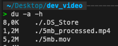

# Video Processor

A C++ application for processing videos with FFmpeg. It can resize videos while maintaining aspect ratio, with a maximum resolution of 1920x1080px. Supports various input formats (mp4, mov, qt, mxf) and converts them to mp4.

## Prerequisites

- CMake 3.15 or higher
- C++17 compatible compiler
- FFmpeg development libraries

### Installing Prerequisites on macOS

```bash
brew install ffmpeg cmake
```

### Installing Prerequisites on Ubuntu/Debian

```bash
sudo apt-get update
sudo apt-get install -y cmake ffmpeg libavcodec-dev libavformat-dev libavutil-dev libswscale-dev
```

## Building the Project

```bash
# Create build directory
mkdir build
cd build

# Configure and build
cmake ..
make

# The build will create two executables:
# - video_processor_cli: Command line interface
# - video_processor_server: HTTP server interface
```

## Usage

### Command Line Interface

```bash
./video_processor_cli input_video.mp4 output_video.mp4
```

### HTTP Server

Start the server:

```bash
./video_processor_server
```

The server will start on `localhost:8999` with the following endpoints:

- `POST /process`: Upload and process a video
  - Send a multipart form with a file field named "video"
- `GET /processed/{filename}`: Download a processed video

Example using curl:

```bash
# Upload and process a video
curl -X POST -F "video=@input.mp4" http://localhost:8999/process

# Download a processed video
curl http://localhost:8999/processed/input_processed.mp4 -o downloaded.mp4
```

## Development

The project is structured into several components:

- `VideoProcessor`: Core class handling video processing
- Command-line interface: Simple file-to-file processing
- HTTP server: RESTful API for video processing

The code is modular and can be extended with additional features or different interfaces as needed.

## Tests

First test on server with `curl -X POST -F "video=@[INPUT_FILE_PATH]" http://localhost:8999/process`

First test results:


